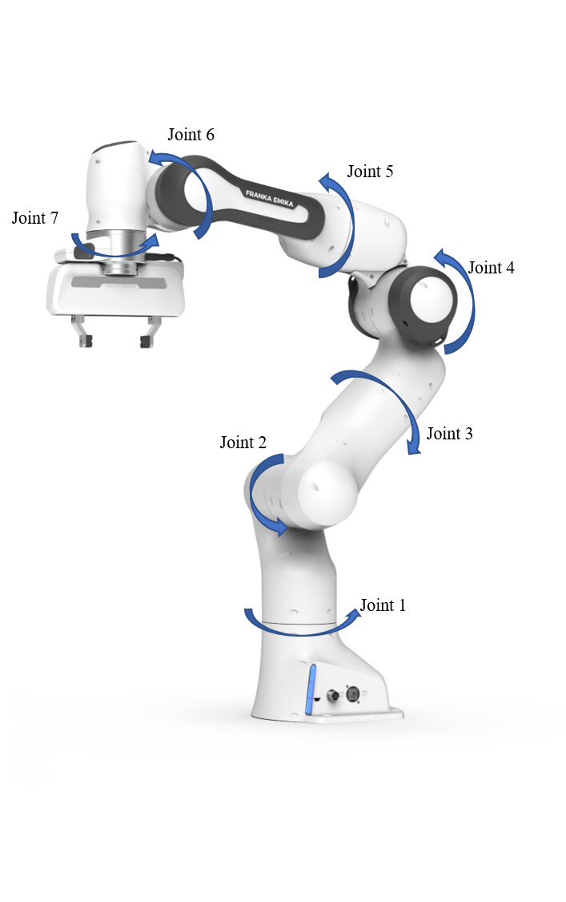

# Franka Cabinet Environment Description

This document provides technical details about the Franka robot arm environment used for the drawer opening task.

## Environment Overview

The environment features a Franka Emika Panda robot arm positioned in front of a cabinet with a drawer. The task is to control the robot arm to grasp the handle of the drawer and pull it open.

## Observation Space

The observation space consists of 23 dimensions:

| Index Range | Description | Dimensions | Details |
|-------------|-------------|-----------|---------|
| 0-8         | Joint Positions | 9 | Scaled positions of 7 arm joints + 2 finger joints, normalized to [-1, 1] |
| 9-17        | Joint Velocities | 9 | Scaled velocities of all 9 joints |
| 18-20       | Target Vector | 3 | Vector from robot hand to drawer handle (x, y, z) |
| 21          | Drawer Position | 1 | Current position of the drawer (how open it is) |
| 22          | Drawer Velocity | 1 | Current velocity of the drawer opening |

## Action Space

The action space consists of 9 dimensions, matching the degrees of freedom (DOF) of the Franka robot:

| Index Range | Description | Dimensions | Details |
|-------------|-------------|-----------|---------|
| 0-6         | Arm Joint Controls | 7 | Controls for the 7 arm joints |
| 7-8         | Gripper Controls | 2 | Controls for the 2 gripper fingers |

Each action dimension specifies a delta command (change in position) for the corresponding joint. These are integrated over time to produce position targets:

```
targets = current_dof_targets + speed_scales * dt * actions * action_scale
```

The targets are then clamped to remain within the joint limits.

## Franka Robot Structure

### Arm Joints (7 DOF)
Reference images:
- https://www.researchgate.net/figure/The-7DoF-Franka-Emika-Panda-robot-arm_fig2_378309540
- https://www.researchgate.net/figure/Panda-robot-with-labeled-joints_fig1_361659008


1. **Base joint**: Rotates the entire arm around the vertical axis (swivel motion)
2. **Shoulder joint**: Allows up/down movement of the upper arm
3. **Arm rotation**: Rotates the upper arm along its axis
4. **Elbow joint**: Controls the up/down movement of the forearm
5. **Forearm rotation**: Rotates the forearm along its axis
6. **Wrist bend**: Allows the wrist to bend up and down
7. **End effector rotation**: Final rotation at the end of the arm before the gripper

### Gripper Joints (2 DOF)

8. **Finger joint 1**: Controls one finger of the parallel gripper
9. **Finger joint 2**: Controls the other finger of the parallel gripper
