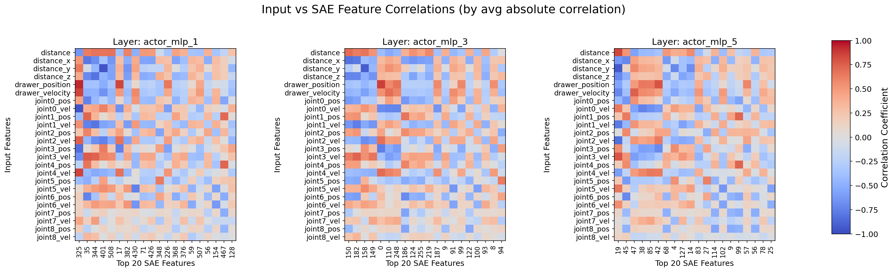
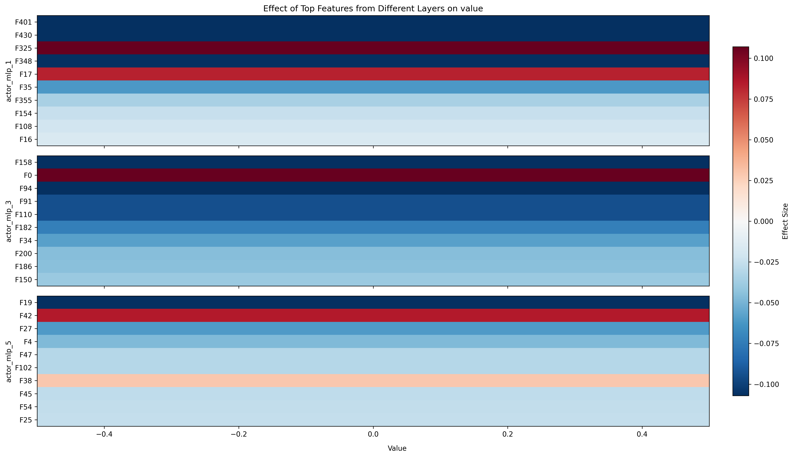

# Mech Interp for Robots -- On a Franka Robot Arm Model trained with Eureka

## Abstract

We apply mechanistic interpretability techniques to neural networks trained using Eureka `[1]`, an algorithm that leverages large language models to automatically discover reward functions for robotic control tasks. While Eureka has demonstrated the ability to generate reward functions that outperform human designs, the internal mechanisms of models trained with these rewards remain opaque, creating potential safety concerns for deployment in physical environments. We analyze a series of progressively improved models trained to control a Franka robot arm for drawer opening.

Our analysis reveals that Eureka-generated reward functions provide valuable interpretability markers that predict feature sensitivity distributions in trained models. However, these semantic clues alone cannot explain the full complexity of model behavior. Through a multi-method approach combining correlation analysis, phase selectivity, principal component analysis, sparse autoencoders, and intervention studies, we identify three key organizational principles: (1) progressive specialization across network layers, transitioning from general feature extraction to phase-specific representations; (2) functional separation between perception (position-sensitive) and locomotion (velocity-sensitive) processing; and (3) task-phase specialization, with later layers prioritizing the critical drawer-opening phase.

These findings demonstrate how neural networks structure procedural knowledge for sequential control tasks and highlight the complementary relationship between semantic reward descriptions and mechanistic interpretability techniques.

## Introduction

### Motivation: Why Mechacnistic Interpretability for Robots?
- Mechanistic interpretability is well studied for vision `[4]` and language `[3]` models, which usually encode declarative knowledge, i.e. the end result is grounded (e.g. tokens in text, patches in images which can be immediately understood by a human).

- However, mechanistic interpretability is understudied for robot models, which usually encode procedural knowledge, i.e. the end result contains low level details (e.g. time series of joint angles, positions and velocities) which still require another layer of reasoning to understand the end goal (e.g. opening a drawer). As of writing, to the best of our knowledge, there is only one existing work `[5]` which extracts interpretable control vectors for motion transformers.

- Robot models eventually operate in the physical world, where a higher level of safety is required.

### Trend: AI-driven AI improvement
A recent trend in the research community is to use AI to automate the AI training process, usually through reinforcement learning (RL) and large language models (LLMs) `[9]`. 
Such frameworks have demonstrated autonomous optimization, occasionally surpassing human-designed solutions. 

Some examples include using LLMs to generate exploration goals in RL `[6]`, LLMs to iteratively refine reward functions `[7]`, and AI to generate data for training a preference model (Reinforcement Learning from AI Feedback (RLAIF) `[8]`).

#### Eureka

(image from `[1]`)

One such example of AI-driven AI improvement is the Eureka `[1]` algorithm, which automates reward function design in reinforcement learning, a task traditionally requiring human expertise. The algorithm leverages large language models to evolve increasingly effective reward functions through an iterative process:

1. Initial reward function generation: A coding language model analyzes environment source code and task descriptions to create initial reward functions

2. Evolutionary optimization: The algorithm iteratively:
   - Generates variations of promising reward functions
   - Evaluates each variant through GPU-accelerated RL training
   - Uses LLM-based reflection on training outcomes to guide the next generation

This automated approach has demonstrated the ability to discover reward functions that outperform human-designed alternatives on average, over 29 RL tasks.

### Motivation: Why interpret Eureka-trained robot models?

Our research focuses on interpreting neural networks trained with Eureka-discovered reward functions for three key reasons:

First, as Eureka's automatically generated reward functions consistently outperform human-designed alternatives, robotic control systems will likely utilize such automated methods to greater extents in the future.

Second, these AI-discovered reward functions can encode complex objectives that are difficult for humans to fully comprehend through inspection alone. Models trained on these rewards may develop equally complex internal representations and behaviors, creating potential safety risks without proper interpretability methods.

Third, there's valuable scientific insight to be gained by examining whether the semantic representations from the reward design process can serve as clues for identifying functional circuits within the trained model.

## Methods

### Environment, Training Process, and Model Generation with Eureka

#### Franka Cabinet Environment
We analyzed a Franka robot arm model trained to open a drawer in a simulated environment. The robot is positioned in front of a cabinet with a drawer, and the task requires the arm to reach for the handle, grasp it, and pull the drawer open to a specific position.

**Observation space** (23 dimensions):
- 9 joint positions (7 arm joints + 2 finger joints, normalized to [-1, 1])
- 9 joint velocities for all joints
- 3D vector from hand to drawer handle (x, y, z)
- Drawer position (how open it is)
- Drawer velocity

**Action space** (9 dimensions):
- Velocity commands for each of the robot's 9 joints (7 arm + 2 gripper)

More details in [here](./chapters/franka_cabinet_env_desc.md)

#### Neural Network Architecture
All models share the same architecture: a 3-layer MLP backbone with decreasing layer sizes [256, 128, 64], using ELU activation functions, followed by a final linear layer to map to the action space. The network takes observations as input and outputs joint velocity actions through an Actor-Critic (A2C) framework with continuous action space.

More details in [here](./chapters/franka_cabinet_nn_models.md)

#### Eureka Training Process
We trained three progressively improved models on reward functions generated using the Eureka algorithm:

1. **Weak model**: Successfully reaches the drawer handle but fails to pull it
2. **Medium model**: Partially pulls the drawer but doesn't open it sufficiently to complete the task
3. **Strong model**: Successfully pulls the drawer open, completing the task

The image below shows the montage of the 3 models in action.

The Eureka algorithm generated different reward functions for each model iteration:

- All models included terms for distance to handle, drawer position, and drawer velocity
- The strong model uniquely emphasized drawer velocity using an exponential function (vs. linear in other models)
- The medium model used higher coefficients for drawer position and velocity compared to the weak model
- Each reward function incorporated insights from analyzing the performance of previous iterations

#### Data Collection for Analysis
For our mechanistic interpretability analysis, we:
1. Sampled 64 trajectories from each model during inference
2. Recorded both external metrics (observations, actions) and internal neuron activations
3. Labeled trajectory phases (approaching, opening, deceleration) using rule-based criteria

This data provides the foundation for our subsequent mechanistic interpretability analysis.
We also calculated the total distance to the handle as an engineered feature.

### Mechanistic Interpretability Methods

To systematically analyze the internal representations of Eureka-trained models, we employed multiple complementary mechanistic interpretability techniques:

#### 1. Feature Correlation Analysis
We calculated correlation coefficients between neuron activations and observation features, identifying neurons with strong feature selectivity (threshold ≥ 0.7 absolute correlation). This analysis revealed how different layers represent task-relevant environmental variables.

#### 2. Phase Selectivity Analysis
We developed a rule-based approach to segment trajectories into three distinct behavioral phases:
- Approaching the handle
- Opening the drawer
- Deceleration (when friction slows the handle or the model stabilizes it)

For each neuron, we calculated a phase selectivity ratio--the mean activation during a specific phase divided by mean activation during other phases. Neurons with selectivity ratios ≥ 2.0 were considered phase-selective, with higher ratios indicating stronger phase specificity.

#### 3. Principal Component Analysis
We performed PCA on neuron activations at each network layer and computed correlations between principal components and input features. This dimensionality reduction approach revealed how the network organizes information and which feature combinations explain the most variance in neural activity.

#### 4. Sparse Autoencoder Analysis
We trained sparse autoencoders (SAEs) on neuron activations to attempt to identify latent features that might not be apparent through direct correlation analysis.

#### 5. Circuit Analysis
We traced activation pathways through the network for each output neuron, identifying the most significant contributing neurons from previous layers. 

#### 6. Intervention Studies
We performed targeted ablation experiments on:
- Principal components: Zeroing out specific PCs and measuring effects on actions
- SAE features: Ablating specific latent features and analyzing downstream impacts

Together, these methods provided a multi-faceted view of how Eureka-trained models structure and process information to accomplish the drawer-opening task.

## Results and Discussion

### Eureka Reward Functions can be used as Interpretability Markers

We investigated whether the semantically meaningful rewards generated by Eureka could provide interpretable clues about model internals. This approach addresses a core question: can the semantics encoded in automatically generated reward functions predict the representational properties of models trained on those rewards?

The full reward functions can be found [here](./chapters/eureka_rewards.md). Analysis of these functions revealed significant structural differences:

- The strong model emphasizes drawer velocity through an exponential transformation (`torch.exp(door_velocity / temperature_velocity)`) rather than the linear scaling used in the other 2 models
- The strong model applies a hyperbolic tangent transformation (2 * `torch.tanh(door_open_value) * 3.0`) to drawer position rewards, with a higher coefficient than other models
- The medium model employs higher coefficients for drawer position and velocity compared to the weak model, potentially explaining its ability to initiate the pulling motion which the weak model fails to do

To quantify how these reward differences manifest in model internals, we analyzed correlations between reward-relevant inputs and first-layer neuron activations by plotting the absolute correlation coefficients in a histogram:

This analysis revealed compelling alignment between reward design and neural representations:

1. The strong model exhibits significantly higher sensitivity to drawer velocity than the medium model (mean 0.494 vs 0.427)--the exact feature emphasized by its exponential reward transformation
2. The medium model shows greater sensitivity to both drawer position and velocity compared to the weak model, consistent with its higher coefficients in the reward function

All models were able to reach the drawer, despite their differences in sensitivity to handle distance

These findings suggest that Eureka's reward function semantics directly influence the feature sensitivity distributions in trained models. The correlation patterns observed in first-layer neurons closely mirror the emphasis placed on different features in each model's reward function.

However, while reward functions provide valuable interpretability markers, they offer incomplete explanations of model behavior. Notably, they provide no insights into how the models process joint position and velocity information--essential components of the observation space. The following analyses focus on these unexplained aspects of model representation, with a focus on the strong model if not stated otherwise.

### Brief behavior analysis
We plotted various relations between in and output features to get a sense of the model's behavior.
A simple result we understood is during the approach phase, the model tends to slow down as it approaches the handle (fine-grained control)

### Correlation Analysis
Our correlation analysis revealed how neurons across different network layers respond to key input features. We identified neurons with strong feature correlations (absolute correlation ≥ 0.7) across the network hierarchy:

| Feature | Early Layer | Middle Layer | Late Layer |
|---------|---------------------------|----------------------------|--------------------------|
| Distance | 80 neurons (31.2%) | 20 neurons (15.6%) | 11 neurons (17.2%) |
| Drawer Position | 67 neurons (26.2%) | 16 neurons (12.5%) | 6 neurons (9.4%) |
| Drawer Velocity | 72 neurons (28.1%) | 25 neurons (19.5%) | 15 neurons (23.4%) |
| **Total unique neurons** | **119 neurons (46.5%)** | **36 neurons (28.1%)** | **19 neurons (29.7%)** |
| **Total neurons in layer** | **256** | **128** | **64** |

This analysis reveals that the early layer contains the highest proportion of feature-correlated neurons (46.5%), with fairly balanced representation across all three features. This suggests this layer primarily performs feature extraction, with later layers showing more specialized processing. Notably, drawer velocity maintains relatively high representation across all layers, reflecting its critical importance in the task.

### Phase Selectivity Analysis
Using a ratio of in-phase vs. out-of-phase mean activations (threshold ≥ 2.0), we identified neurons selectively active during specific task phases:

| Phase | Early Layer | Middle Layer | Late Layer |
|---------|---------------------------|----------------------------|--------------------------|
| Approaching | 29 neurons (11.3%) | 51 neurons (39.8%) | 18 neurons (28.1%) |
| Opening | 12 neurons (4.7%) | 39 neurons (30.5%) | 33 neurons (51.6%) |
| Deceleration | 13 neurons (5.1%) | 24 neurons (18.8%) | 14 neurons (21.9%) |
| **Total neurons in layer** | **256** | **128** | **64** |

The phase selectivity reveals a clear progression in how the network organizes task phases:
- The early layer exhibits minimal phase specialization, with only 21.1% of its neurons showing phase selectivity
- The middle layer demonstrates substantial phase representation (89.1% of neurons show phase selectivity), with approaching phase neurons dominating
- The final layer shows strongest specialization in the critical opening phase (51.6%), suggesting prioritization of the task's primary objective

### Integrated Analysis of Feature and Phase Representations

By examining both feature correlation and phase selectivity together, we can construct a comprehensive model of information flow through the network:

**Early Layer (256 neurons):** This layer primarily functions as a general feature extractor, with nearly half of its neurons (46.5%) strongly correlated with input features, but minimal phase organization (only 21.1% phase-selective). This suggests its role is to transform raw sensory inputs into useful representations without imposing significant task structure.

**Middle Layer (128 neurons):** A critical transformation occurs here, as the network shifts from feature representation to phase-structured processing. While feature correlation decreases (28.1% of neurons), phase selectivity dramatically increases (89.1%). This layer appears to transform feature representations into behaviorally relevant phase information, with particular emphasis on the approaching phase (39.8% of neurons), establishing the sequential structure of the task. Interestingly, opening phase neurons are less abundant (30.5%), while correlation prioritizes drawer velocity (a feature meant for opening phase), followed by distance (a feature meant for approach phase).

**Late Layer (64 neurons):** The final layer maintains similar feature correlation (29.7%) to the middle layer but reorganizes phase representation to prioritize the opening phase (51.6% of neurons). This specialization in the mechanically complex and task-critical opening phase, combined with sustained drawer velocity encoding (23.4% of neurons), suggests optimization for the primary objective: successfully opening the drawer.

This progressive specialization--from feature encoding to phase-structured representations—reveals how the network organizes computational resources to solve the sequential task of drawer opening.

### Principal Component Analysis

To further elucidate representational structure across network layers, we applied principal component analysis (PCA) to neuron activations and examined correlations between principal components and input features. This analysis complements our correlation and phase analyses by revealing how the network organizes information dimensionally.

#### Cross-Layer Component Analysis

We analyzed the first three principal components at each major layer of the network (layers 1, 3, and 5 representing the activation function layers), examining their correlations with input features:

**Layer 1 (First hidden layer):**

**Layer 3 (Second hidden layer):**

**Layer 5 (Third hidden layer):**

This analysis revealed a systematic organization of information across layers:

- **Layer 1:** The principal components exhibit distinct functional specialization:
  - PC1 demonstrates strong negative correlations with absolute distance metrics
  - PC2 primarily correlates with joint position information, suggesting specialization in perception
  - PC3 predominantly encodes joint velocity information, particularly for distal joints, potentially facilitating fine-grained control during approach

- **Layer 3:** PC2 shows increased sensitivity to both distance_y and drawer metrics, suggesting emerging specialization for the opening phase of the task

#### Phase-Specific Component Structure

To investigate whether component structure varies by task phase, we conducted a focused analysis of Layer 1 activations during the approach phase:

This phase-specific analysis reveals that during the approach phase:
1. The first two principal components account for a dominant proportion of activation variance
2. These components organize into distinct functional categories: proprioceptive perception (predominantly joint positions) and locomotion control (predominantly joint velocities)

### Clustering Analysis
We performed clustering on the activations to see if there are any groups of neurons that are similar.

We use 3 clusters, and then project them for visualization and color them by phases to see if our rule-based phase labeling is consistent with the clustering. We project them via T-SNE and PCA.

We see that while the clusters do capture the phases, it does not do so perfectly.

We then calculate the silhouette score over a range of clusters and plot them.

It seems like the optimal number of clusters is 5, suggesting there might be further behaviors that are not captured by the current phase labeling.

### SAE Analysis

We train SAEs `[2]` and then correlate the inputs with the SAE features.

Result: Confirmation of more perception and locomotion features

The fact that SAEs do not unwrap the "checkered" dimensions (alternating high and low values) show that perception n locomotion are grouped objects, and the model doesn't think about one joint in isolation.

### Circuit analysis
Images in `results/circuits/strong`

#### Circuit construction

The circuits are constructed by tracing the activation pathways through the network for each neuron in the output layer. For each neuron, we:

1. **Find Maximally Activating Examples**:
   - Identify examples that maximally activate the neuron in both positive and negative directions
   - Filter examples to keep only those above a threshold (70% of max activation)

2. **Trace Important Contributors**:
    - For each maximally activating example
        - Going from reverse layer order, for each neuron in that layer,
            - Identify previous layer neurons that contribute significantly to the activation: accumulate neuron activations by magnitude till we reach a threshold (50% of total activation to limit neurons to a reasonable number)
            - Add these neurons to the circuit and a queue, continue tracing backwards

#### Visualization legend

**Basics**:
- Input layer (observations): We color nodes differently based on whether they are joint positions, joint velocities, drawer metrics or distance coordinates to handle.
   We do so because we saw how different principal components are sensitive to different groups of these features
- Edge thickness represents the contribution (activation * weight) to the downstream neuron
- Edge color: Green (red) edges indicate positive (negative) contribution

**Special neurons**:
We style some neurons differently to highlight their importance, and to help identify patterns in the circuits

- **Neurons with high correlation to input features**:
   - Node color indicates strength of strongest correlation
   - Node size increases for each feature it is sensitive to
   - Limit correlation threshold to 0.8 as many early layer neurons have high correlation with multiple features

- **Phase Selective Neurons**:
   - Node shape indicates phase:
     - Diamond (`d`): approaching phase
     - Triangle up (`^`): opening phase
     - Square (`s`): deceleration phase

#### Analysis
- We do not display the circuits here as despite only accumulating 50% of the activation, they are quite dense for display.
- Generic asymmetry in output direction: Number of neurons in the final MLP layer usually differ by a large amount for the same action but with opposite direction -- Can be explained from the videos, the motion is usually asymmetric
- Presence of 'perception' circuits (high attention to joint position inputs but not joint velocities) quite common, reinforcing earlier findings.

### Intervention analysis
#### PCA ablation
Ablate layer 1 PC to measure action effects

Result: PC3 responsible for elbow movement (joint 3)
which is the main joint used to open the drawer (see vid)

PC3 looks at downstream joint velocities, suggesting a circuit between them

#### SAE Feature ablation
We then ablate the SAE features, and measure the changes in downstream SAE features and actions.

Result: Confirmation of layer specialization in different joints

## Conclusions and Future Work

Our mechanistic interpretability study of Eureka-trained robot arm models yielded several significant insights into how neural networks organize information to execute complex sequential control tasks.

First, we found that automatically discovered reward functions do provide meaningful clues for understanding model internals. The patterns of feature sensitivity distributions in the neural networks directly mirror the emphasis placed on specific features in their corresponding reward functions. This suggests a promising direction for using reward function semantics as interpretability markers, though these markers alone are insufficient for comprehensive understanding.

Second, our analysis revealed a clear pattern of progressive specialization across network layers:
- Early layers primarily function as general feature extractors with minimal phase-specific organization
- Middle layers transform these representations into phase-structured information, establishing the sequential nature of the task
- Later layers specialize in the most critical phase (drawer opening), optimizing for the primary task objective

Third, we identified a consistent organization of neural representations into two functional categories: perception (primarily sensitive to position information) and locomotion (primarily sensitive to velocity information). This separation was evident across multiple analysis methods including correlation analysis, PCA, SAEs, and circuit analysis.

Our intervention studies provided causal confirmation of these findings, demonstrating how targeted ablation of specific components affects downstream activations and task performance. Notably, we found that principal components associated with joint velocities were causally responsible for the elbow movement critical to drawer opening.

These findings address our initial research questions about the interpretability of AI-trained models for robotic control. While Eureka's LLM-generated reward functions do provide useful semantic guidance, understanding the full inner workings requires complementary mechanistic interpretability techniques.

The primary limitation of our work is the focus on a single task with relatively simple dynamics. Future work should extend these methods to more complex robotic tasks and architectures. Additionally, our phase-based analysis relied on hand-crafted rules; developing automated techniques for identifying behavioral phases would significantly enhance scalability.

The most promising directions for future research include time series analysis of model dynamics, automatic grounding of low-level actions to semantic labels, and program distillation--extracting explicit, interpretable programs from neural networks. Such approaches could substantially improve both the interpretability and safety of AI-trained robotic control systems as they become increasingly prevalent.

## Acknowledgements
This project was conducted during the Spring 2025 round of the [SPAR](https://sparai.org/) program under the guidance of Rick Goldstein.

## References
[References](references.md)

## Appendix
[Appendix](APPENDIX.md)