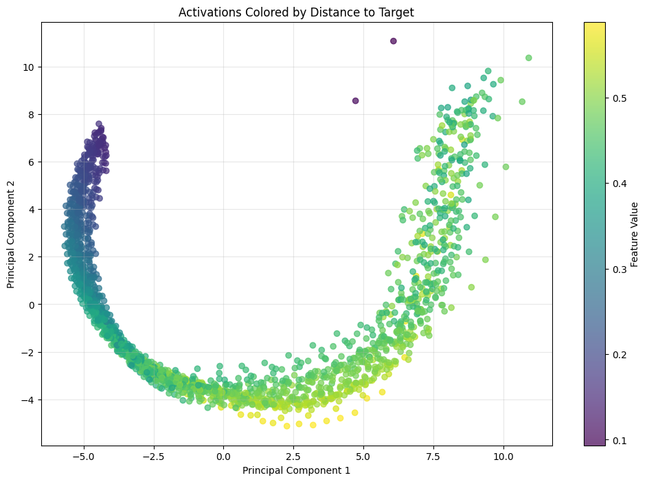
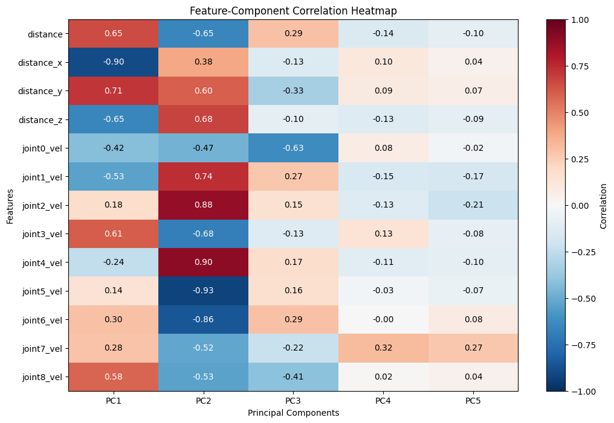

# Mech Interp for Robots -- On a Franka Robot Arm Model trained with Eureka

## Abstract
<!-- Provide a broad overview that includes the research question posed, its significance, the methodology, and the main results or findings. Do not add footnotes or cited works in this section. Try to keep this section to 100-200 words.  -->

This research investigates the mechanistic interpretability of neural networks trained with automatically discovered reward functions through the Eureka algorithm. While Eureka leverages large language models to evolve increasingly effective reward functions for robotic control, the internal mechanisms of models trained with these rewards remain opaque, creating potential safety risks. We address this gap by applying interpretability techniques to a Franka robot arm model trained to open a drawer.

Our methodology combines correlation analysis, phase-based selectivity measurements, and principal component analysis across three network layers. Results reveal a clear progression of representational specialization: the early layer functions primarily as a feature extractor (46.5% of neurons correlated with environmental features); the middle layer transforms these features into phase-structured representations (89.1% of neurons showing phase selectivity); and the late layer specializes in the critical opening phase (51.6% of neurons) while maintaining strong velocity encoding.

This progressive specialization from feature encoding to phase-structured representations demonstrates how the network organizes computational resources to accomplish the task. Our findings provide a foundation for understanding causal mechanisms in Eureka-trained models, offering new techniques for safety verification in increasingly automated robotic control systems where understanding internal circuitry is essential for reliable operation.

## Introduction and Statement of the Problem
<!-- State the main research problem. What precisely are you studying and why is it important? Will it fill a gap in other studies? Try to keep this section to 100-350 words. -->

The Eureka (Ma et al., 2023) algorithm represents a significant advancement in reinforcement learning by automating reward function design, a process traditionally performed by human experts. This algorithm operates by first ingesting environment source code and task descriptions to generate initial reward functions through a coding language model. It then iterates through an evolutionary process: generating variant reward functions, evaluating them through GPU-accelerated RL training, and using LLM-based reflection on the results to progressively refine subsequent generations.

Our research examines the safety implications of neural networks trained with these automatically discovered reward functions. This focus is crucial for several reasons:

First, Eureka-generated reward functions consistently outperform human-designed alternatives, suggesting that future robotic control systems will increasingly rely on such automated methods. Second, these automatically discovered reward functions can encode complex, emergent objectives that may be difficult for humans to fully understand by inspection. The resultant models trained on such rewards may develop equally complex internal representations and behaviors. Without proper interpretability methods, this complexity creates potential safety risks in deployment.

Most importantly, while the Eureka process leverages semantic representations during its reward design iterations (through LLM reflection), we currently lack similar insight into the trained model's internal circuitry. Our research addresses this gap by applying mechanistic interpretability techniques to Eureka-trained models, specifically a Franka robot arm trained to open a drawer.

Through this work, we aim to answer a critical question: Can we identify and understand the internal neural circuits responsible for key behaviors in models trained with automatically discovered reward functions? Success in this endeavor would provide new techniques for safety verification of increasingly automated AI systems, particularly in robotic applications where understanding causal mechanisms is essential for ensuring reliable and safe operation.

An side interesting question is whether the semantic representations of the reward design process can be used as clues for identifying circuits in the trained model.

## Methodology
<!-- Discuss your research methodology. Describe the specific design of the study and provide clear and concise description of the procedures that were performed. Try to keep this section to 200-500 words.  -->

### Model training
We trained a Franka robot arm model (3 layer MLP) with Eureka, and have generations of models over the Eureka iterations, namely:
- Strong model (iteration 2)
- Medium model (iteration 1)
- Weak model (iteration 0)

The weak model can reach for the handle but struggles to open the drawer. The medium model can open the drawer but struggles to open it fully. The strong model can reach for the handle and open the drawer till the task is complete.

We start off by examining the strong model's behavior.

### Data collection
- Collect trajectories (observations, actions) and neuron activations from 64 runs per model
- Capture and store activations with observation metadata during inference
- Compute feature metrics (distances, joint positions/velocities) and phase masks for analysis

### Correlation analysis
- Calculate correlation coefficients between neuron activations and observations
- Identify neurons strongly responsive to specific features using thresholds
- Generate correlation heatmaps to visualize encoding patterns
- Calculate summary statistics of high-correlated neurons

### Phase analysis
Use rule-based approach to label phases in the drawer opening task, namely:
- approaching the handle
- opening the drawer
- deceleration (friction is slowing down the handle / model letting go or stabilizing the handle)

We then calculate the selectivity of neurons in each phase (ratio of in-phase vs. out-of-phase activation) and highlight those with a ratio of at least 2.

### PCA analysis (preliminary)
Focusing on the approaching phase, we perform PCA on the first layer's neuron activations and project the activations against the principal components.

We then
- Correlate components with input features
- Perform regression analysis to quantify feature importance
- Visualize component weights, variance explained, and feature-colored projections

## Preliminary Results

<!-- What actually happened during your project? What are your preliminary results? This section should mostly present quantitative results, so it’s the ideal place to include your graphs, tables, diagrams, or other visual aids. Try to keep this section to 200-400 words. -->

### Correlation analysis
Percentages represent proportion of neurons in each layer with absolute correlation ≥ 0.7 for the given feature

| Feature | Early Layer | Middle Layer | Late Layer |
|---------|---------------------------|----------------------------|--------------------------|
| Distance | 80 neurons (31.2%) | 20 neurons (15.6%) | 11 neurons (17.2%) |
| Drawer Position | 67 neurons (26.2%) | 16 neurons (12.5%) | 6 neurons (9.4%) |
| Drawer Velocity | 72 neurons (28.1%) | 25 neurons (19.5%) | 15 neurons (23.4%) |
| **Total unique neurons** | **119 neurons (46.5%)** | **36 neurons (28.1%)** | **19 neurons (29.7%)** |
| **Total neurons in layer** | **256** | **128** | **64** |

### Phase analysis

| Phase | Early Layer | Middle Layer | Late Layer |
|---------|---------------------------|----------------------------|--------------------------|
| Approaching | 29 neurons (11.3%) | 51 neurons (39.8%) | 18 neurons (28.1%) |
| Opening | 12 neurons (4.7%) | 39 neurons (30.5%) | 33 neurons (51.6%) |
| Deceleration | 13 neurons (5.1%) | 24 neurons (18.8%) | 14 neurons (21.9%) |
| **Total neurons in layer** | **256** | **128** | **64** |

### PCA analysis

## Discussion
<!-- This section is where you can include analysis and discussion of the quantitative results from above. Here’s where you would include hypotheses about what could be driving your results, interesting future lines of research, and potential implications of your results on other research agendas. Try to keep this section to 200-500 words.  -->

### Comparing Correlation Analysis with Phase Analysis Results

Our dual analysis approach reveals a compelling progression of representational specialization through the network:

**Early Layer:** This layer exhibits mixed correlations (no single feature dominates) and relatively low phase selectivity (only 21.1% of neurons are phase-selective). This suggests the early layer primarily serves as a general feature extractor, encoding environmental variables without strong task-phase specialization.

**Middle Layer:** A transition occurs in this layer, where phase selectivity dramatically increases (89.1% of neurons show phase selectivity). Notably, approaching phase neurons dominate (39.8%), followed by opening phase neurons (30.5%), and correlation prioritizes drawer velocity, followed by distance (which can seem counterintuitive). Nonetheless, this indicates the middle layer transforms raw sensory features into task-relevant representations organized by behavioral phases.

**Late Layer:** The final layer completes this specialization, with over half its neurons (51.6%) dedicated to the opening phase—the most critical portion of the drawer-opening task. Meanwhile, feature correlation remains similar to the middle layer (29.7%), with drawer velocity maintaining the highest correlation (23.4%). This aligns with the mechanical requirements of the task, where precise velocity control is essential during drawer opening.

This progressive specialization from feature encoding to phase-structured representations reveals how the network organizes its computational resources. The early layer processes raw inputs, the middle layer organizes information into task phases, and the late layer specializes in the mechanically complex opening phase while maintaining strong velocity encoding needed for successful execution.

### PCA analysis
The curve in the principal component 1 and 2 plot with distance does suggest some nonlinearity which we need to uncover in future work.

The first principal component is highly correlated with distance features, while the second is highly correlated with velocity features, which might hint that the first is more responsible for perception while the second is more responsible for action.

## Next Steps 
<!-- Highlight what you will focus on and what you will try to accomplish during the next half of the program. Try to keep this section to 150-400 words.  -->

Having completed initial data collection and correlation analysis, our next steps are:

- Further PCA analysis, especially on layer 0 neuron activations to identify components representing distance information
- SAEs to interpret the middle layer
- Group neurons by activation patterns to find clusters that consistently activate during specific phases
- Implement causal interventions by modifying distance inputs and observing changes in model outputs

## References
Ma, Y.J., Liang, W., Wang, G., Huang, D.A., Bastani, O., Jayaraman, D., Zhu, Y., Fan, L. and Anandkumar, A., 2023. Eureka: Human-level reward design via coding large language models. arXiv preprint arXiv:2310.12931.
