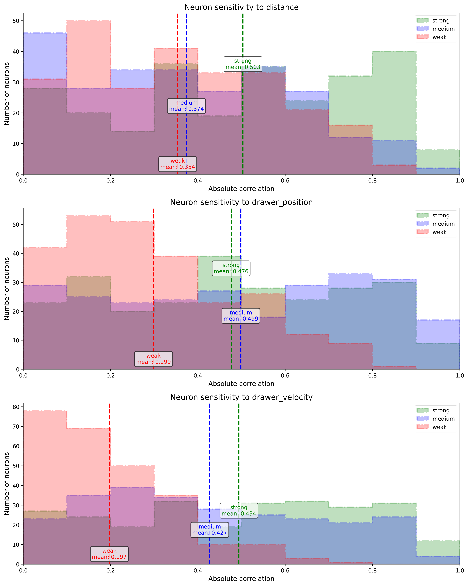

## Experiments
`scripts/correlation/plot_correlations.py`

### Results
```
Sensitivity Statistics:

DISTANCE:
  Strong model:
    Mean: 0.5034
    Max: 0.9695
    Top 5 neuron indices: [190 231 208 145 217]
  Medium model:
    Mean: 0.3739
    Max: 0.9372
    Top 5 neuron indices: [ 49  83 253 218  61]
  Weak model:
    Mean: 0.3538
    Max: 0.8329
    Top 5 neuron indices: [188 102 184  33 226]

DRAWER_POSITION:
  Strong model:
    Mean: 0.4764
    Max: 0.9825
    Top 5 neuron indices: [152 202  32  43 164]
  Medium model:
    Mean: 0.4986
    Max: 0.9893
    Top 5 neuron indices: [204 180  64  53 107]
  Weak model:
    Mean: 0.2985
    Max: 0.8727
    Top 5 neuron indices: [198 193 246 236 101]

DRAWER_VELOCITY:
  Strong model:
    Mean: 0.4941
    Max: 0.9883
    Top 5 neuron indices: [227  64  73 246  84]
  Medium model:
    Mean: 0.4273
    Max: 0.9704
    Top 5 neuron indices: [140  65 223   5 174]
  Weak model:
    Mean: 0.1972
    Max: 0.7400
    Top 5 neuron indices: [217 192 159 174 182]
```


